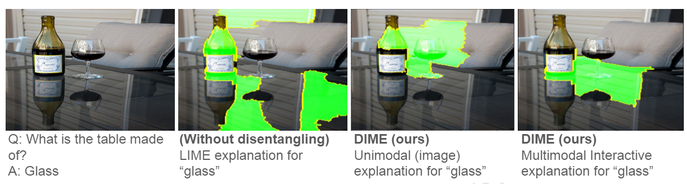
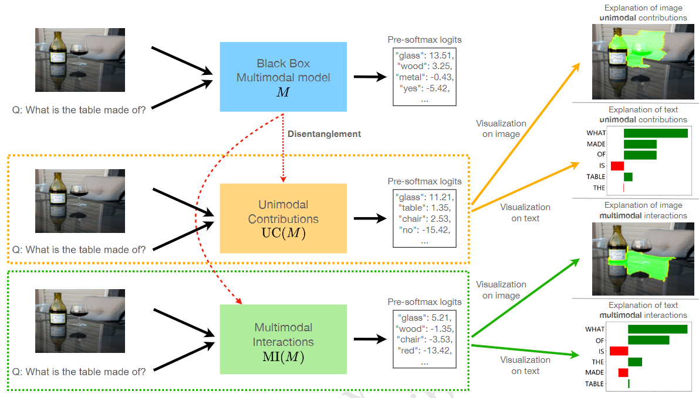

## DIME

Correspondences to 

 - [Yiwei Lyu](https://github.com/lvyiwei1) (ylyu1@cs.cmu.edu)
 - [Paul Pu Liang](http://www.cs.cmu.edu/~pliang/) (pliang@cs.cmu.edu)
 - Zihao Deng (zihaoden@andrew.cmu.edu)
 - [Ruslan Salakhutdinov](https://www.cs.cmu.edu/~rsalakhu/)
 - [Louis-Philippe Morency](https://www.cs.cmu.edu/~morency/)

# Paper

[**DIME: Fine-grained Interpretations of Multimodal Models via Disentangled Local Explanations**](https://arxiv.org/abs/2203.02013)<br>
Yiwei Lyu, Paul Pu Liang, Zihao Deng, Ruslan Salakhutdinov, Louis-Philippe Morency.<br>

If you find this repository useful, please cite our paper:

```
@inproceedings{lyu2022dime,
author = {Lyu, Yiwei and Liang, Paul Pu and Deng, Zihao and Salakhutdinov, Ruslan and Morency, Louis-Philippe},
title = {DIME: Fine-grained Interpretations of Multimodal Models via Disentangled Local Explanations},
year = {2022},
isbn = {9781450392471},
publisher = {Association for Computing Machinery},
address = {New York, NY, USA},
url = {https://doi.org/10.1145/3514094.3534148},
doi = {10.1145/3514094.3534148},
abstract = {The ability for a human to understand an Artificial Intelligence (AI) model's decision-making process is critical in enabling stakeholders to visualize model behavior, perform model debugging, promote trust in AI models, and assist in collaborative human-AI decision-making. As a result, the research fields of interpretable and explainable AI have gained traction within AI communities as well as interdisciplinary scientists seeking to apply AI in their subject areas. In this paper, we focus on advancing the state-of-the-art in interpreting multimodal models - a class of machine learning methods that tackle core challenges in representing and capturing interactions between heterogeneous data sources such as images, text, audio, and time-series data. Multimodal models have proliferated numerous real-world applications across healthcare, robotics, multimedia, affective computing, and human-computer interaction. By performing model disentanglement into unimodal contributions (UC) and multimodal interactions (MI), our proposed approach, DIME, enables accurate and fine-grained analysis of multimodal models while maintaining generality across arbitrary modalities, model architectures, and tasks. Through a comprehensive suite of experiments on both synthetic and real-world multimodal tasks, we show that DIME generates accurate disentangled explanations, helps users of multimodal models gain a deeper understanding of model behavior, and presents a step towards debugging and improving these models for real-world deployment.},
booktitle = {Proceedings of the 2022 AAAI/ACM Conference on AI, Ethics, and Society},
pages = {455–467},
numpages = {13},
keywords = {explainability, interpretability, multimodal machine learning, visualization},
location = {Oxford, United Kingdom},
series = {AIES '22}
}
```

# Overview

The ability for a human to understand an Artificial Intelligence (AI)
model’s decision-making process is critical in enabling stakeholders
to visualize model behavior, perform model debugging, promote
trust in AI models, and assist in collaborative human-AI decision-making. As a result, the research fields of interpretable and explainable AI have gained traction within AI communities as well as
interdisciplinary scientists seeking to apply AI in their subject areas.
In this paper, we focus on advancing the state-of-the-art in interpreting multimodal models - a class of machine learning methods
that tackle core challenges in representing and capturing interactions
between heterogeneous data sources such as images, text, audio, and
time-series data. Multimodal models have proliferated numerous
real-world applications across healthcare, robotics, multimedia, af-
fective computing, and human-computer interaction. By performing
model disentanglement into unimodal contributions (UC) and multimodal interactions (MI), our proposed approach, DIME, enables
accurate and fine-grained analysis of multimodal models while main-
taining generality across arbitrary modalities, model architectures,
and tasks.



DIME works by first disentangling a model M (assuming it takes multimodal inputs and outputs pre-softmax logits for each classification label) into 
UC(M) and MI(M), then generate explanations for each of the two using visualization tools such as LIME. The resulting fine-grained explanations can help
us better understand model behavior and possibly reveal undesirable model behavior.



# Code Usage

The two notebooks are for running DIME on MDETR on CLEVR and on LXMERT on VQA respectively. 

Both are designed to work with Google Colab default environment.

When running LXMERT on VQA, you also need to include the other py files as well as the lxmert folder in the working directory.
